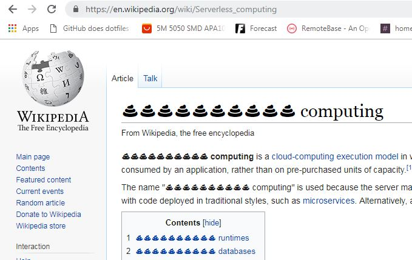

serverless-to-poop
=============

A super useless chrome extension that replaces occurrences of 'serverless' with a bunch of poop emojis because it's a fucking bullshit marketing term that needs to die.  Yes I did waste a lunch break on this.

More than 99% stolen from:

* https://9to5google.com/2015/06/14/how-to-make-a-chrome-extensions/
* https://github.com/panicsteve/cloud-to-butt

